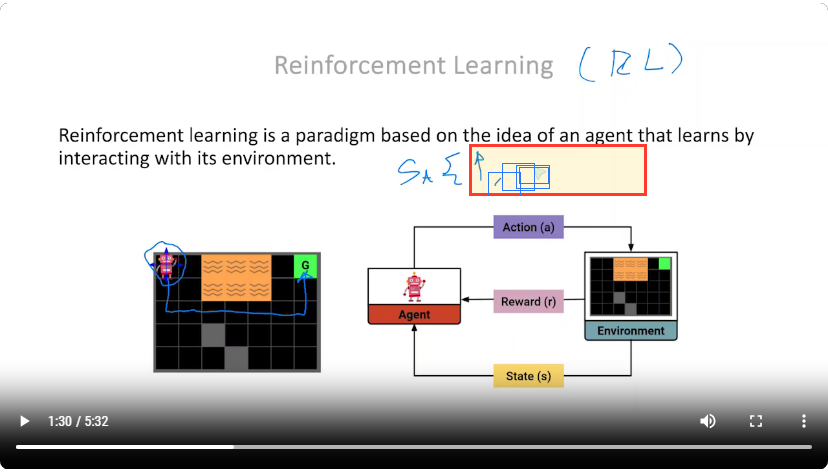

# veasyguide-app — documentation

Why this app exists, how it works, and — mostly — **why it is the way it is**. The code
says what happens; these documents say why, what we rejected, and what we deliberately
deferred.

| Document | Read it when you want to know… |
|---|---|
| [architecture.md](architecture.md) | How a dropped video becomes highlights on screen. The pipeline, streaming analysis, segments. |
| [decisions.md](decisions.md) | **Why** each major call was made — no server, no OpenCV.js, no YouTube, streaming, scene detection, and what we rejected. |
| [parameters.md](parameters.md) | What every analysis parameter does, why the heuristic exists, and which way to turn it. |
| [research-data.md](research-data.md) | The data we capture for future ML (features, node logs, snippets), the export schema, and the privacy line. |
| [debug-tools.md](debug-tools.md) | The `?debug`, `?research`, `?snippets` flags, the analyzer view, and how to measure performance honestly. |
| [porting-notes.md](porting-notes.md) | Bugs found in the original VeasyGuide code during the port, and what changed. |
| [design.md](design.md) | The original approved design doc (office-hours session, 2026-07-12). Historical; superseded in places by the docs above. |

## The one-paragraph version

VeasyGuide was a research study rig: a Python script analyzed lecture videos offline, and
a React player showed the results to study participants. This app turns that into something
anyone can use: **drop a lecture video, and the analysis runs in your browser** — no upload,
no account, no server ever touches the video. It detects where the instructor is pointing,
writing, and sketching, then plays the video back with a highlight overlay and
content-following magnification, both tunable.

The core insight that makes it possible: for slide-based lecture video, **saliency ≡ change**.
You don't need a model to find where the action is — you need a frame differencer and a
graph. So the whole thing runs client-side, on a laptop, for free.

*The highlight (red border, yellow fill) tracks the annotation the instructor is writing,
in real time. Blue boxes are raw detections, shown here in debug mode.*
