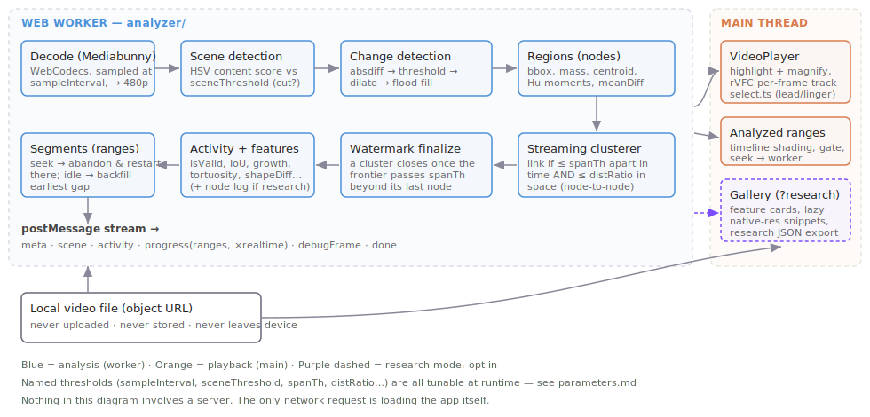

# Architecture

How a dropped video file becomes highlights on screen.



## The idea in one line

For slide-based lecture video, **what changed is what matters**. The instructor's pen, cursor
and annotations are the only things moving on an otherwise static slide — so a frame
differencer finds the action without any model, and a graph groups those changes into
*activities*.

## The pipeline, stage by stage

Everything below runs inside a Web Worker (`src/analyzer/`). Every named parameter is
tunable at runtime — see [parameters.md](parameters.md).

### 1. Decode and sample (`worker.ts`)

Mediabunny demuxes the container and drives WebCodecs to decode frames. We do **not** decode
every frame — we ask for one every `sampleInterval` (default 0.2s, the study's value) via
`samplesAtTimestamps()`, which decodes each packet at most once. Each sampled frame is drawn
onto an OffscreenCanvas at `analysisWidth` (default 480px), which is where the
downscaling happens: the pixel work costs a quarter of what it would at 720p.

Sampling is **time-based**, not frame-index-based, so variable-frame-rate screen recordings
degrade gracefully.

### 1b. Webcam pre-pass (`pipeline.ts: webcamZone`)

Before the main loop, ~24 frames sampled minutes apart are diffed pairwise; pixels that
changed in ≥`webcamPairFrac` of the pairs form the zone's CORE (a person in an inset has
always moved between two frames minutes apart; slides and ink haven't), which is then grown
to the inset's persistent-edge border — the video-in-video boundary present in every frame —
because the inset's quiet side churns less than the slide does and only the rectangle tells
them apart. Detection regions
mostly inside the zone are dropped before clustering, so webcam activities are never created.
A frame-scale churn blob is deliberately *not* a zone — that's a camera video of the
instructor, not an inset. Costs ~1.5 s on an hour-long video; the churn heatmap and zone are
visible under `?debug=1`.

### 2. Scene detection (`pipeline.ts: changedFrac`)

Each sampled frame is compared against the previous one, and a **cut** is declared when more
than `sceneChangeFrac` of the frame changed at once. The signal is the occupancy of the diff
mask that stage 3 computes anyway, so scene detection costs one extra pass over a 480×300 byte
array and no extra decode.

This replaced a port of PySceneDetect's `ContentDetector` (mean HSV delta per pixel), which
could not see a slide change at all on a deck with a consistent style — see
[D7](decisions.md#d7--scene-detection-ported-not-imported).

A cut does three things: it closes the current scene, it **produces no detection nodes**
(a whole-frame change is a slide change, not instructor activity), and it **flushes all open
clusters**, so no activity can ever span two slides. See [D7](decisions.md#d7--scene-detection-ported-not-imported).

### 3. Change detection (`pipeline.ts`)

Between the two grayscale frames:

```
absdiff → threshold(diffThresh) → 3×3 smooth → dilate(dilateIters) → flood fill
```

The flood fill (4-connectivity) yields **regions**, filtered by area against
`contourAreaLowFrac` / `contourAreaHighFrac`. Each region is a **node**: a detection at a
moment in time.

Crucially, the flood fill computes more than a bounding box — it accumulates **mass**
(changed-pixel count), **centroid**, **raw moments → 7 Hu invariants**, and **mean change
intensity**, all in the same pass. That data is unrecoverable later, so we take it now.
See [research-data.md](research-data.md).

### 4. Clustering into activities (`graph.ts`)

Two nodes belong to the same activity if they are close in **time** (≤ `spanTh`, default 1s)
**and** close in **space** (≤ `distRatio` of the frame diagonal, default 5%). Linking is
**node-to-node**, faithful to the original `roi.py` graph edges.

The connected components of that graph are the activities. A pen stroke, a cursor hovering,
a circle being drawn — each is a chain of nearby-in-time-and-space detections.

### 5. Watermark finalization — why this streams

Because the edge criterion is **temporally local** (nothing links across more than `spanTh`),
a cluster whose newest node is older than `frontier − spanTh` can never gain another member.
It is final. We emit it immediately, and the player can show it while analysis continues.

This is what lets playback start after ~10 seconds of analyzed lead instead of after the
whole video. It is also what bounds memory (only the `spanTh` window is held open) and what
eliminates the O(n²) graph build of the Python original.

### 6. Segments and coverage (`ranges.ts`)

Analysis is **not** one forward pass. Coverage is a set of ranges:

- **Seek into unanalyzed video** → the worker abandons its current segment and restarts at
  the viewer's position. The viewer always wins.
- **Segment runs into already-analyzed video (or the end)** → the worker backfills the
  earliest remaining gap.
- Each segment is independent: fresh clusterer, its start treated as a scene start.

The player's timeline shades analyzed ranges (striped), so the state is legible.
See [D12](decisions.md#d12--segment-based-analysis-so-seeking-always-wins).

## The player (`src/player/`)

Ported from the study app, with fixes ([porting-notes.md](porting-notes.md)).

- **`select.ts`** decides which activity is "current" at time *t*: eligible from
  `start − highlightLead` to `end + highlightLinger`, with a **currently-active activity
  always beating a pre-activity cue**. The lead is the accessibility payoff — a low-vision
  viewer needs time to orient their gaze *before* the action, not after it.
- **`HighlightIndicator`** draws the styled box (fill, border, shape, pointer, animation —
  all user-tunable), plus the enhance layer below.
- **`MagnificationOverlay`** mirrors the video onto a canvas and transforms it to zoom into
  the current activity. It only renders while actually zoomed (a fix — see porting notes).
  The pan/zoom maths lives in **`zoom.ts`** and is deliberately *continuous*: as an activity
  approaches a frame edge the pan **saturates** rather than stepping, and everything lives in a
  single animated `transform` — animating two coupled properties is what made the original
  jump ([porting notes](porting-notes.md#the-magnifier-jumped-when-an-activity-was-near-a-frame-edge)).
- Tracking runs on **`requestVideoFrameCallback`**, once per presented frame. The original
  used `timeupdate` (~4 Hz), which visibly lagged the pen.


*Magnification following the instructor's annotation.*

### The enhance layer (`EnhanceCanvas.tsx`, `glEnhance.ts`)

The "enhance" filters — **Bolder ink**, **Bolder ink (dark slide)**, **Sharpen**, **Invert** —
make the region the viewer is being pointed at easier to actually *see*. They apply to the
highlighted region and to the magnifier.

Two non-obvious decisions govern how they're implemented:

**1. We copy the video into a canvas rather than filtering the backdrop
([D14](decisions.md#d14--enhance-filters-copy-the-video-into-a-canvas-instead-of-filtering-the-backdrop)).**
The study player used `backdrop-filter: url(#svg-filter)`, which Firefox and Safari don't
support — and Firefox renders the element at `opacity: 0` rather than degrading, so the
highlight *vanished*. Regular `filter: url(#…)` works everywhere, so the region is mirrored
into a canvas and that is filtered.

**2. The filters run as WebGL shaders, not CSS/SVG filters
([D15](decisions.md#d15--enhance-filters-run-as-webgl-shaders-not-csssvg-filters)).**
CSS filter *functions* (`contrast()`, `blur()`) are GPU-accelerated, but a *reference* filter —
`filter: url(#…)` — drops the browser into its **software** SVG-filter path. `feConvolveMatrix`
(Sharpen) is a per-pixel convolution on the **CPU**, re-run every frame because the canvas
beneath updates every frame. That was a visible CPU load. `glEnhance.ts` implements the same
effects as fragment shaders:

| Filter | Shader |
|---|---|
| `bold-dark` / `bold-light` | 3×3 min/max (erode/dilate) + contrast stretch + saturate, folded into one pass |
| `sharpen` | `[0 −1 0; −1 5 −1; 0 −1 0]` unsharp kernel |
| `invert`, magnifier `contrast` | point ops in the final pass |

The SVG defs in `SVGFilters.tsx` remain as the **no-WebGL fallback**, and as the reference
implementation the shaders are written to match.

### Redraw discipline — and the trap in it

Both enhance surfaces repaint on **`requestVideoFrameCallback`**: once per *new video frame*
(≈30/s for a lecture), not once per display refresh (144/s on a fast monitor), and **not at all
while paused**.

That last part bit us. rVFC never fires on a paused video — so **toggling a filter while paused
left the canvas showing the previous render** until playback resumed. Anything that changes the
output and *isn't* a new video frame must explicitly ask for a repaint: `driveFrames()` returns
a `redraw` handle, and both surfaces call it when the filters, contrast, or source region change.
If you add a new setting that affects the rendered pixels, **wire it into that redraw** or it
will look broken while paused.

> **Debugging note.** The GL canvas is created with `preserveDrawingBuffer: false`, so
> `gl.readPixels()` from *outside* the render loop always reads black — the buffer is cleared
> after compositing. Verify visual output with screenshots (the composited frame), never with
> `readPixels`.

## Coordinate spaces

Three of them, and mixing them up is the classic bug:

| Space | Where | Units |
|---|---|---|
| **Analysis** | everything in `analyzer/` | `analysisWidth`-wide pixels (default 480) |
| **Video** | `player/types.ts: PlayerActivity` | native video pixels (e.g. 1280×720) |
| **Container** | rendered overlays | CSS pixels, via `scaleRatio` + letterbox shifts |

`AnalysisMeta.scale` (= `videoWidth / analysisWidth`) converts analysis → video.
`toPlayerActivity()` is the only place that conversion happens.

## What is *not* here

No server. No database. No video storage. No ML model. No OpenCV. The only network request
the app makes is loading its own JavaScript.
