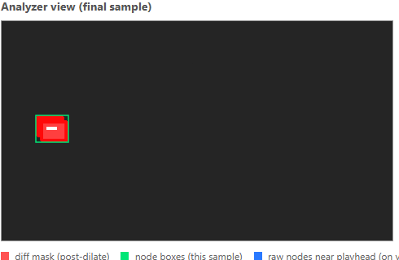

# Debug & research tools

Everything here is **off by default** — including in development, deliberately, so that a dev
run measures the same thing a production run does
([D6](decisions.md#d6--performance-is-measured-never-assumed)).

## Flags

| Flag | Turns on | Cost |
|---|---|---|
| `?debug=1` | Analysis parameters panel, analyzer view, raw-node overlay, scene strip, run comparison table | free (see below) |
| `?research=1` | Per-node region logs + the Activity gallery + research JSON export | memory + export size |
| `?snippets=1` | Presets the gallery's snippet toggle on (native-res image crops) | a few seconds, post-analysis |
| `?test=<name>` | **dev only** — auto-loads `public/_test/<name>` (headless smoke tests) | — |

Combine freely: `?debug=1&research=1&snippets=1`.

Without any flag, the app is just the player: video, highlights, magnification, settings, and
the ×-realtime meter (which is a product feature, not a debug one).

---

## The analyzer view (`?debug=1`)



This is what the analyzer *sees*, per sampled frame:

- **red** — the post-dilate diff mask: pixels the pipeline considers "changed"
- **green** — the node boxes extracted from that mask (this sample's detections)
- **blue** (drawn on the video itself) — raw nodes near the playhead, pre-clustering

It follows the analysis frontier live, and **you can scrub it** through every sample after
the fact. Each frame carries its timestamp and node count; clicking the canvas seeks the
video to that moment.

This is the tool for tuning. Crank `diffThresh` and watch the red mask thin out; raise
`dilateIters` and watch specks fuse into one box. If detection is doing something you don't
expect, look here first.

**Storage.** Frames are WebP-encoded (~10–25 KB each) and held **in memory only** — a
6-minute lecture is ~13 MB. Nothing is written to disk; a refresh clears them. Capped at
6000 frames.

### Frame capture is the expensive half

The analyzer view requires WebP-encoding every sampled frame inside the analysis loop. That
costs **+51% wall time**. It is a separate checkbox (*capture analyzer frames*) so you can
turn it off and keep the rest of debug mode, which is effectively free.

Measured on a 180s 720p clip:

| Configuration | ×realtime |
|---|---|
| No debug at all (production) | 16.7× |
| `?debug=1`, capture **off** | 16.6× |
| `?debug=1`, capture **on** | 11.0× |


Completed runs accumulate in that table (wall time, ×realtime, % vs the no-capture run at the
same analysis width), so any change — a new parameter, a pipeline optimization — can be priced
in-session.

> **If you are benchmarking hardware, turn capture off.** Reading the meter with capture on
> understates the machine by ~35%, and could wrongly conclude that a perfectly viable laptop
> needs mitigations.

---

## The scene strip (`?debug=1`)


Detected scenes as clickable segments. If a lecture with obvious slide changes shows one
scene, `sceneChangeFrac` is too high; if a single slide fragments into many, it's too low.

---

## The activity gallery (`?research=1`)

One card per finalized activity: its feature vector, its time range (click to seek), an
`invalid` badge if it failed the size heuristic, and — with snippets on — a native-resolution
crop of its region.

See [research-data.md](research-data.md) for what the features mean and how to export them.

---

## Dev-only handles

`window.__magSettings` (`{ get(), set(partial) }`) exists in dev builds only. The player's
settings live inside popovers that close on focus loss, which makes them awkward to drive from
an automated browser — this exists so the enhance/magnification behaviour can be exercised
headlessly.

```js
__magSettings.set({ filter_style: ["invert"], contrast: 1.5 });
```

> **Do not verify GL output with `gl.readPixels()`.** The enhance canvas is created with
> `preserveDrawingBuffer: false`, so reading it from outside the render loop always returns
> black (the buffer is cleared after compositing). Use a screenshot — it captures the
> composited frame.

## Verifying a change

```bash
npx tsc -b                                          # types
node --experimental-strip-types src/analyzer/selfcheck.ts   # pipeline/clusterer/feature logic
npm run dev                                         # then open with the flags above
```

`selfcheck.ts` is the runnable check for everything pure: region stats, Hu-moment invariance,
watermark finalization, activity selection (lead/linger/precedence), range bookkeeping, scene
scoring, and feature separation. It needs no browser and runs in about a second. If you change
the pipeline, it should still pass — and if it can't, that's the fact you needed.
