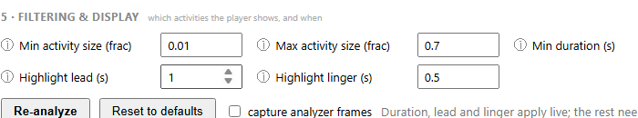
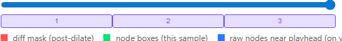
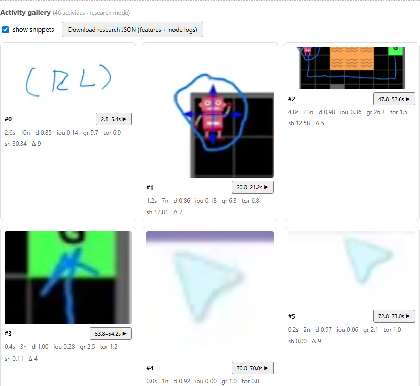

# Decisions

Every significant call, why it was made, and what we rejected. Newest concerns at the
bottom of each entry. If you are about to change one of these, read the "why" first — most
were made against a real constraint, and a few were made against a real bug.

---

## D1 — The analysis runs in the browser, not on a server

**Decision.** No backend. The video is loaded as an object URL and analyzed by a Web Worker
on the user's machine. The only network request is fetching the app itself.

**Why.** The pipeline is frame differencing and graph clustering — no ML model, no GPU
requirement. Once you notice that, the server stops earning its keep: it costs money, it
becomes a privacy liability (someone's unpublished lecture recording sitting on a disk),
and it adds an upload wait longer than the analysis itself. Client-side, the strongest
possible privacy claim is also the *literally true* one: the video never leaves the device.

**Consequences.** Deployment is a static site. There is no "analyze once, share the link"
without adding a backend later (the analysis JSON can be exported/imported instead). The
compute bill lands on the user's laptop, which is why performance is measured, not assumed
(see D6).

---

## D2 — No YouTube ingestion

**Decision.** v1 accepts local video files only. Pasting a YouTube link is not supported.

**Why.** Analysis needs the actual pixels. YouTube's embedded player is a cross-origin
iframe: you cannot read its frames, so you cannot analyze it, and you cannot magnify it
either (magnification needs `drawImage(video)` on a canvas). The only way to get the pixels
is to pull the stream (yt-dlp or equivalent), which is squarely against YouTube's Terms of
Service — and browsers can't do it anyway (no CORS headers on `googlevideo.com`), so it
would require a server proxy, i.e. a ToS violation *plus* the backend we just deleted.

**Rejected alternatives.**
- *Server-side download.* ToS violation. Also resurrects D1.
- *Client-side fetch of the stream.* Blocked by CORS, and still a ToS violation.

**Future option, if wanted.** `getDisplayMedia` tab capture: the user plays the video in
YouTube's own player and shares that tab. Playback stays inside YouTube's player, so it is
not "accessing content by other means" — the user is sharing their own screen. Clunky UX
(permission prompt, analysis runs at playback speed) and not built.

---

## D3 — Pure TypeScript pipeline, no OpenCV.js

**Decision.** The image operations (grayscale, absdiff, threshold, dilate, connected
components, moments) are ~200 lines of plain TypeScript in `analyzer/pipeline.ts`.
OpenCV.js is not a dependency.

**Why.** The original Python used exactly four OpenCV features: the frame-diff chain,
`findContours`, `matchShapes`, and (optionally) OCR. OCR is cut. `matchShapes`'s only
consumer was the activity **type** classification, which is also cut from v1 (see D8) —
so the one operation that genuinely needed OpenCV had no caller. Everything left is
element-wise arithmetic and a flood fill, and at 480p analysis resolution it is fast in
plain JS. OpenCV.js would have added ~8 MB of WASM to buy nothing.

*(We later reimplemented Hu moments by hand anyway — see D9 — which is the mathematical
core of `matchShapes`, about 40 lines.)*

---

## D4 — Mediabunny for demux + decode

**Decision.** Use [Mediabunny](https://github.com/Vanilagy/mediabunny) to demux the
container and drive WebCodecs, rather than hand-rolling it.

**Why.** This is the one part of the pipeline where hand-written code dies: container
parsing (MP4/WebM/MKV variants), codec configuration, and the "give me a frame at time *t*
without decoding the whole file" problem. Mediabunny's `samplesAtTimestamps()` does exactly
what the analyzer needs — an optimized monotonic decode that visits each packet once — and
hardware-accelerated decode is what makes the whole thing 10–20× realtime instead of 1×.

**Rejected.** `@doedja/scenecut-web` for scene detection (see D7): it demuxes and decodes
the video *itself*, meaning we would pay for decode twice. Decode is the expensive part;
everything else is a rounding error.

---

## D5 — Streaming analysis with watermark finalization

**Decision.** Analysis is a forward stream, not a batch job. Activities are emitted to the
player as soon as they can no longer change, and playback begins after a short analyzed
lead (10s) rather than waiting for the whole video.

**Why it's possible.** Look at the edge criterion in the original `roi.py`: two detection
nodes can only be connected if they are within `spanTh` (1s) of each other in time. There
is no criterion anywhere that spans the whole timeline. Therefore a cluster whose newest
node is older than `frontier − spanTh` **can never gain another member** — it is final, and
can be emitted immediately. This is the standard watermark pattern from stream processing,
and it falls straight out of the algorithm's own locality.

**Why it matters.** A 6-minute lecture at ~15× realtime still takes ~25 seconds to analyze
fully. Making the user watch a progress bar for 25 seconds before playback is a worse
product than starting in 3 seconds and racing ahead. It also bounds memory: only nodes
inside the `spanTh` window need to be held.

**Bonus.** This also kills the O(n²) graph build of the Python version by construction —
edge candidates are only the nodes in the current window.

---

## D6 — Performance is measured, never assumed

**Decision.** A ×-realtime meter is a first-class part of the app, not a debug afterthought.
Debug instrumentation is off by default (even in dev) so a development run measures the
same thing a production run does.

**Why.** The target users — low-vision learners — skew toward weak hardware (school-issued
Chromebooks, older laptops, often already running a screen magnifier). "It's fast on my
M-series MacBook" is not evidence. An early cross-model review flagged the throughput
assumption as the single riskiest thing in the plan, and it was right to.

**What we found.** On a dev laptop, 720p → 480p analysis runs at ~16–20× realtime. Debug
tooling itself is free (16.6× vs 16.7×); **frame capture** — the WebP encoding for the
analyzer view — costs **+51% wall time**. Any benchmark reading taken with capture on
understates the machine by ~35%.

**Still open.** The gating benchmark on genuinely low-end hardware has not been run. The
degradation path if it's slow is already parameterized (lower analysis width, longer sample
interval, or an "analyze first, then play" mode), so this is patchable, not architectural.

---

## D7 — Scene detection, ported not imported

**Decision.** Implement PySceneDetect's `ContentDetector` (~25 lines: mean HSV
hue+saturation+luma delta between sampled frames, thresholded) rather than adding a
scene-detection library.

**Why.** The only browser-side option, `@doedja/scenecut-web`, does its own demux and
decode — paying twice for the expensive step (see D4) — to replace an algorithm that is a
weighted frame difference. We already have the frames.

**A divergence you must know about.** The Python analyzer ran `ContentDetector` on *every
adjacent frame* (~33 ms apart) at **threshold 14**. We compare frames one `sampleInterval`
apart (200 ms), so more change accumulates between them and the score runs systematically
higher. Copying `14` would over-trigger. Our default is **27**, and it is tunable. This is
why parameters have documented reasoning and not just values.

**The parity behavior that mattered.** In the Python version, frame pairs were generated
*per scene*, so no frame difference ever crossed a cut. We reproduce this: a cut's own frame
pair produces no detection nodes, and all open clusters are flushed at the boundary.
**Activities can never span a scene change.** On a 3-slide test video this is the difference
between one bogus activity smeared across all three slides and three correct ones — and it
was very likely part of the "results don't feel one-to-one with Python" that prompted the
investigation.

---

## D8 — Activity *type* classification is deferred

**Decision.** v1 does not classify activities as `pointing` / `marking` / `sketching` /
`animation` / `add_sub`. Activities are type-less; the player highlights and magnifies
them all the same way.

**Why.** The original classifier was a stack of hand-tuned thresholds on shape difference,
duration and aspect ratio (`RoIActivity._calc_type`) with a `TODO: Maybe improve type
recognition in the future` comment on it. The player never used `type` for anything the
viewer sees — only the research inspector colored by it. Cutting it removed the only
consumer of `matchShapes` (see D3) and cost nothing user-facing.

**The plan instead.** Capture the data a *learned* classifier would need, and revisit
(see D9 and [research-data.md](research-data.md)). An LLM or a clustering model over
activity features is a better answer than more thresholds.

---

## D9 — Capture ML-ready data now, because it is unrecoverable later

**Decision.** Three layers, deliberately separated:

| Layer | What | When |
|---|---|---|
| **A — Features** | ~14 aggregate numbers per activity (IoU, trajectory, growth, shape-consistency, density, intensity) | **Always on.** Cheap, tiny, useful today. |
| **B — Node logs** | Every detection node with bbox, mass, centroid, 7 Hu moments, change intensity | **Opt-in** (`?research=1`) |
| **C — Snippets** | Native-resolution image crops of each activity region | **Opt-in** (`?snippets=1` / toggle) |

**Why now.** Almost all of this exists *inside the flood fill* for a few microseconds and is
then thrown away when we keep only the bounding box. Computing it later means re-analyzing
the video — and the video may be gone (we don't store it). Whatever we don't capture at
analysis time is lost. Features and moments cost almost nothing to compute alongside the
work already being done.

**The privacy line.** Layers A and B are *derived measurements* — numbers about pixels.
Layer C is *pixels*: snippets are literal fragments of the video. That's a different
category, so:
- Snippets are **generated lazily on the client, for display only**, from the video file the
  user already has open.
- They are **never included in any export**, even in research mode. Exporting image data
  would need its own explicit consent, and is deliberately not built.
- The claim "we don't store your video" stays literally true.

*Research mode. Note that the two natural classes are already visible to the naked eye —
blue ink (writing/sketching) vs. translucent cursor arrows (pointing) — and their feature
vectors differ accordingly (`iou`, `gr`, `sh`). That's the signal a future classifier will
learn from.*

---

## D10 — Snippets are generated post-hoc, not during analysis

**Decision.** Image crops are made *after* analysis, by seeking a hidden `<video>` element
to each activity's timestamp and cropping its region.

**Why.** The obvious approach — save crops while analyzing — is worse in three ways: it
would slow the analysis loop (the thing we most want to protect), it would only capture the
downscaled 480p analysis frames, and it would run even when nobody looks at them. Post-hoc
generation is **free of analysis cost**, produces **native-resolution** crops, and only
happens when snippets are actually switched on. It also works for a cached analysis when the
same file is re-opened.

---

## D11 — The player was ported with fixes, not copied

**Decision.** The study player (VideoPlayer, HighlightIndicator, MagnificationOverlay, both
settings suites) was carried across, but reviewed on the way in.

**Why.** It was study code: it worked well enough to run an experiment. That is a lower bar
than "runs on a stranger's Chromebook". The review found real bugs — most notably a
per-frame video→canvas readback that ran **forever, even when the magnifier was invisible**,
taxing every second of playback on precisely the hardware we're worried about.

Full list in [porting-notes.md](porting-notes.md).

---

## D12 — Segment-based analysis, so seeking always wins

**Decision.** Analysis coverage is a **set of ranges**, not a single frontier. Seeking into
unanalyzed video makes the worker abandon its current segment and restart at the viewer's
position; when a segment runs into already-analyzed video, the worker backfills the earliest
remaining gap.

**Why.** With a single forward pass, seeking ahead put the viewer somewhere the analyzer
wouldn't reach for minutes, with no highlights and no way to hurry it. The viewer's position
is the only thing that matters in the moment, so it preempts everything.

**Accepted cost.** Each segment is independent (fresh clusterer, its start treated as a
scene start), so an activity straddling a segment boundary can appear as two. This is
cosmetic and only at a boundary the user themselves created by seeking. Stitching is
possible (the edge rule is local) but not built.

**A bug this design produced, and its fix.** A segment stopping at an already-analyzed
boundary left behind a sliver shorter than one sample interval; the gap-filler then re-picked
that sliver forever without ever producing a sample — the worker hung at "analyzing" and
never finished. Segments now claim coverage right up to the boundary, plus a no-progress
guard. Worth knowing about if you touch `ranges.ts`.

---

## D13 — Settings persist in localStorage

**Decision.** Highlight and magnification settings moved from `sessionStorage` (the study's
choice) to `localStorage`.

**Why.** In a study, every participant should start from identical defaults — sessionStorage
is correct there. For a real user, an accessibility configuration is *theirs*: a low-vision
learner who has tuned border width, fill opacity and zoom strength to their vision should
not have to redo it every visit. Different product, different default.
