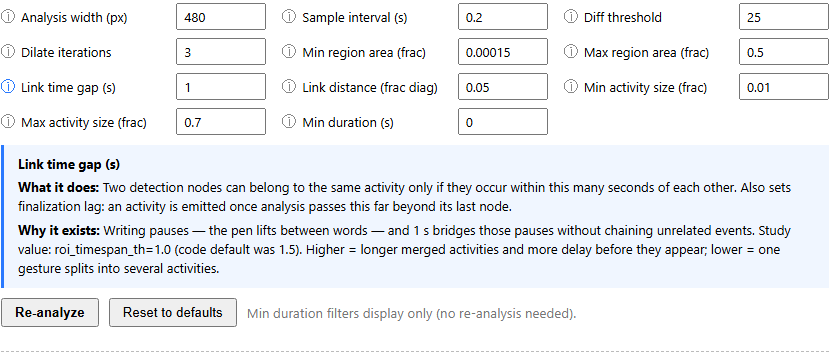

# Analysis parameters

Every parameter, what it does, and **why the heuristic exists**. Defaults come from the
VeasyGuide study unless noted otherwise.

These are live-editable in the app under `?debug=1` → *Analysis parameters*, where each one
carries the same explanation as an ⓘ card. The source of truth is `PARAM_FIELDS` in
`src/App.tsx` (docs) and `DEFAULT_PARAMS` in `src/analyzer/types.ts` (values).

A parameter without a documented *why* doesn't get added. That's the rule.

---

## 1 · Sampling — which pixels the analyzer looks at

### `analysisWidth` = 480 px
Frames are downscaled to this width before any pixel work; detected coordinates are scaled
back up for the overlays.

**Why.** Pixel cost scales with area, and slide content is coarse enough to survive
downscaling — 480p is ~4× cheaper than 720p. The Python analyzer ran at native resolution,
so set this to the video's width to reproduce it exactly.
**Lower** = faster but thin pen strokes (1–2 px) can vanish.

### `sampleInterval` = 0.2 s
Time between the two frames that get compared. Also the analysis step.

**Why.** Adjacent frames (~33 ms) differ too little to segment; comparing across 200 ms
accumulates enough change to see a pen stroke, and cuts the work ~6×.
Study value: `sample_fps_ratio = 0.2`.
**Higher** = brief pointing gestures fall between samples. **Lower** = finer timing, more compute.

---

## 2 · Change detection — frame pair → changed regions

### `diffThresh` = 25
Minimum grayscale change (0–255) for a pixel to count as changed.

**Why.** Video compression makes pixels wiggle a few units even in perfectly static regions;
25 sits above codec noise, while ink-on-slide changes are high-contrast and clear it easily.
Python: `threshold(blur, 25)`.
**Lower** = more sensitive, but noise blobs appear. **Higher** = faint cursors and low-contrast marks are missed.

### `dilateIters` = 3
Grows the changed-pixel mask outward ~1 px per pass before regions are extracted.

**Why.** One pen stroke fragments into disconnected specks after thresholding; dilation glues
them into a single region so it's detected as one node instead of ten.
Python: `cv2.dilate(iterations=3)`.
**More** = distinct nearby events merge. **Fewer** = fragments get dropped by the area filter.

### `contourAreaLowFrac` = 0.00015
Changed regions smaller than this fraction of frame area are discarded as noise.

**Why.** Residual compression shimmer survives thresholding as tiny blobs; real activity is
bigger. 0.00015 of 720p ≈ a 12×12 px blob. Python: `contour_area_low`.
**Lower** = keeps tiny marks (the dot on an *i*) plus more noise.

### `contourAreaHighFrac` = 0.5
Changed regions larger than this fraction of frame area are discarded.

**Why.** A slide transition or scroll changes most of the frame at once — that's a scene
change, not instructor activity, and without this cap it becomes one giant bogus "activity".
Python: `contour_area_high`. (Before scene detection existed, this was the *only* thing
standing between us and that failure; now it's a backstop.)

### `persistFrac` = 0.35
Every pixel carries a running estimate of how often it changes — an EMA over the last ~20
sampled frames, rendered **blue** in the debug composite. A detected region whose pixels
average this much or more is **flagged** as structural motion rather than instructor activity.
Flagging alone hides nothing; it feeds the per-activity veto, [`persistInvalidFrac`](#persistinvalidfrac--05).
Not in the Python version. See `updateOccupancy` and `Region.occ` in `analyzer/pipeline.ts`.

**Why.** A talking-head webcam overlay — or an animated logo, a scrolling ticker, a blinking
caret — never stops moving, so its pixels churn for the whole video. Ink is the opposite: a
pen crosses a pixel once and then leaves it alone forever. On our synthetic case that gap is
enormous — a drifting head averages **occ ≈ 0.67**, handwriting **≈ 0.12** — which is what
makes a single cutoff between them viable.

**Lower** = flags more, eventually catching a region the instructor works in continuously.
**Higher** = the webcam stops being flagged.

**Why a score and not a veto.** The first version of this simply zeroed high-occupancy pixels
out of the mask, and it does not survive contact with real video. A person *moves*: only the
core of the head changes on nearly every frame (occ ≈ 0.9), while the silhouette edges drift
around and sit near 0.3–0.5. Delete the core and the edges still form regions in the corner,
still cluster, still take the highlight. The robust signal isn't "this pixel always changes",
it's "**every** pixel in this region changes far more often than ink ever does" — a judgement
about a region, and then about an activity, not about a pixel.

The occupancy map is per-segment, with a fixed ~20-frame memory (`OCC_ALPHA`), so an overlay
is learned within ~4 s of a segment's start at the default sampling, and a layout change
re-adapts about as fast. Cut frames are excluded from it — a whole-frame change would
otherwise nudge *every* pixel toward "always moving".

---

## 3 · Scene detection — slide changes / cuts

### `sceneChangeFrac` = 0.08
A cut is declared when this share of the frame changes between two sampled frames — the
occupancy of the diff mask. The cut's frame pair yields no nodes, and open activities are
closed at the boundary — **activities never span a cut**.

**Why occupancy and not a content score.** The Python analyzer used PySceneDetect's
`ContentDetector` (mean HSV delta over every pixel) and we ported it. It does not work on
lecture slides. Consecutive slides in a deck share a background, a header and a layout — only
the text differs — so a real slide change moves a fifth of the pixels a long way and leaves
the rest pixel-identical, and the *mean* washes it out. Measured over a 59-minute lecture:
every slide change scored **under 2.5 against a threshold of 27**, and not one was caught; the
7 cuts it did find were all in the first 17 minutes, where the presenter dropped out of
presentation mode to the desktop. Counting *changed pixels* separates the same footage with an
order of magnitude of clearance at each end.

| on that lecture | share of frame changed |
|---|---|
| typical frame (writing, webcam) | 0.4% (median) |
| noise ceiling | 2.1% (p99) |
| **slide changes** | **20–30%** |
| cut to the desktop | 70%+ |

**Calibration caveat.** 0.08 sits in the gap, but it was chosen against **one** lecture, and
sanity-checked against a whiteboard recording (peak 0.68% changed → correctly no cuts). It is
the number most likely to need revisiting on unfamiliar footage.
**Lower** = more cuts (a big build animation may split a slide). **Higher** = slide changes leak into activities.

### `sceneMinLen` = 1.0 s
Debounce: no second cut until this long after the previous one.

**Why.** A transition (fade, wipe, build animation) crosses the threshold on several
consecutive samples and would otherwise register as a burst of cuts. Not in the Python
version, which detected per-frame; at our coarser sampling an explicit debounce is the
simpler equivalent.

---

## 4 · Clustering — regions over time → activities

### `spanTh` = 1.0 s
Two nodes can belong to the same activity only if they occur within this many seconds of
each other. **Also sets finalization lag**: an activity is emitted once analysis passes this
far beyond its last node (the watermark — see [architecture](architecture.md#5-watermark-finalization--why-this-streams)).

**Why.** Writing pauses — the pen lifts between words — and 1 s bridges those pauses without
chaining unrelated events. Study value: `roi_timespan_th = 1.0` (the code's default was 1.5).
**Higher** = longer merged activities *and* more delay before they appear. **Lower** = one gesture splits into several.

### `distRatio` = 0.05
Max spatial gap between two nodes' boxes, as a fraction of the frame diagonal.

**Why.** Consecutive strokes of one annotation land near each other; unrelated activities
happen across the slide. 5% of the diagonal ≈ 73 px at 720p. Python: `roi_distance_ratio`.
Linking is **node-to-node** (not node-to-cluster-bbox — see [porting notes](porting-notes.md)).
**Higher** = neighbouring distinct activities merge. **Lower** = a fast-moving pointer splits into pieces.

---

## 5 · Filtering & display — what the player shows, and when

### `persistInvalidFrac` = 0.5
Validity heuristic: an activity with at least this share of its member nodes flagged as
structural motion (see [`persistFrac`](#persistfrac--035)) is marked `isValid: false` — hidden
from the timeline and never highlighted. `1` disables it. The gallery shows the measured share
per activity as `occ 0.87 (0.67)`: flagged fraction, then mean occupancy.

**Why.** This is the rule that actually keeps the highlight off a talking head. A webcam's
activity is built almost entirely out of flagged nodes (~0.9); a real activity that merely
happens to pass near the webcam picks up a few and survives. Voting per node — rather than
averaging occupancy, or vetoing pixels — is what makes it robust to a person who moves: an
overlay's edge pixels are individually ambiguous, but an activity assembled almost wholly out
of them is not.

Left unhandled, a webcam does three things, all from the fact that it never stops moving:
it **steals the highlight** (its activity is *active* at nearly every `t`, so it wins the
active-precedence rule in `selectActivity` whenever a real activity is only in its
pre-activity lead window); it can **bridge** into content within `distTh` and drag the
highlight box into the corner; and if it never pauses at all, its cluster **never finalizes**,
because `spanTh`-based reaping needs a gap it never gets. The size heuristic below can't catch
any of this — a webcam rect is a perfectly reasonable size.

**Lower** = more aggressive; a real activity that overlaps the webcam gets vetoed too.
**Higher** = a webcam activity with a few stray nodes elsewhere sneaks through.

### `minSizeFrac` = 0.01 / `maxSizeFrac` = 0.7
Validity heuristic: a finished activity's width **and** height must each fall within
[`minSizeFrac`, `maxSizeFrac`] of the frame's, else it is flagged `isValid: false` (hidden,
not deleted — the gallery still shows it, dimmed).

**Why.** Below ~1% of the frame it's usually noise that survived clustering, and too small to
usefully highlight or zoom into. Above ~70% it's a scene-level change (scroll, transition,
camera move) — highlighting it is meaningless and magnifying it impossible.
Python: `roi_area_low` / `roi_area_high` in `RoIActivity._is_valid`.

### `minDuration` = 0.1 s
Display filter only (no re-analysis): activities shorter than this are hidden — from the
timeline lane, the moments sidebar AND the on-video highlight, since all three read the same
filtered list.

**Why.** Sub-second blips — a stray cursor flick — can distract more than help. This one comes
from the *player*, not the analyzer: the study player filtered by duration (`atLeast`, up to
1.5 s in some modes) when choosing what to highlight. The 0.1 default exists to drop the
zero-length single-detection moments (one frame of change, "0.0s" in the sidebar), which are
flashes rather than moments; anything long enough to watch survives. Thumbnails are generated
for every valid activity regardless of this filter, so loosening it later never surfaces a
row without one.

### `highlightLead` = 1.0 s
**The pre-activity cue.** The highlight appears this many seconds *before* the activity
starts — but a currently-active activity always takes precedence, so the early cue only shows
when nothing else is highlighted.

**Why this matters most.** A low-vision viewer needs time to orient their gaze *before* the
action happens. Cueing at activity start guarantees they miss the beginning of every action.
The lead is what makes the highlight an anticipatory guide rather than a lagging report.
Study player: `padding[0] = 1.0` in normal mode.

### `highlightLinger` = 0.5 s
The highlight stays this many seconds after the activity ends.

**Why.** Dropping the highlight the instant motion stops feels abrupt and yanks attention away
from what was just drawn — and the *result* of the activity is usually what the viewer wants
to read. Study player: `padding[1] = 0.5`.

---

## Which parameters need a re-analysis?

| Change | Effect |
|---|---|
| `minDuration`, `highlightLead`, `highlightLinger` | **live** — display only |
| everything else | requires **Re-analyze** (the pipeline output changes) |
