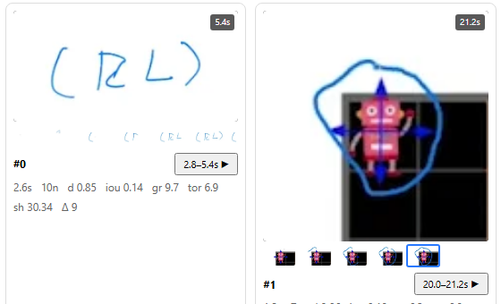

# Research data — what we capture, and why

The long-term goal is to detect the **type** of each activity (is this pointing? writing?
sketching? an animation?) with a learned model rather than the hand-tuned thresholds of the
original ([D8](decisions.md#d8--activity-type-classification-is-deferred)). This document
describes the data we capture so that becomes possible — **without ever storing the video**.

> **The core constraint.** Almost all of the useful signal exists *inside the analysis loop*
> for a few microseconds and is discarded the moment we keep only a bounding box. Once
> analysis is done and the video is closed, it is gone. So: capture at source, decide later.

## Three layers

| Layer | Contains | Size | Default | Flag |
|---|---|---|---|---|
| **A — Features** | ~14 aggregate numbers per activity | ~1 KB / video | **always on** | — |
| **B — Node logs** | every detection node with region stats | ~100–300 KB / video | off | `?research=1` |
| **C — Snippets** | native-res image crops per activity | display only, never exported | off | `?snippets=1` |

---

## A — Activity features (always on)

Computed at finalization in `analyzer/features.ts`, attached to every `Activity` as
`.features`. Cheap to compute, tiny to store, and immediately useful — the gallery displays
them, and they are what you'd cluster first.

Each one exists because it maps to a signal the original heuristic used or implied:

| Feature | Meaning | Discriminates |
|---|---|---|
| `duration`, `nodeCount`, `nodesPerSec` | temporal extent and density | brief gestures vs sustained work |
| `meanMass` | avg changed-pixel count per node ("how much ink") | a thin stroke vs a solid blob |
| `meanDensity` | `mass / bbox area` | a diagonal pen stroke (sparse) vs a filled shape (dense) |
| `meanDiff` | avg per-pixel change magnitude | a translucent cursor (subtle) vs fresh ink (strong) |
| `meanConsecIoU` | overlap of consecutive nodes | **pointing** = stays put (high) vs **sketching** = drifts (low) |
| `pathLength`, `displacement` | centroid trajectory | how far the action travelled, and how directly |
| `tortuosity` | `pathLength / displacement` | wandering pointer vs directed underline |
| `xSpread`, `ySpread` | centroid std-dev | spatially compact vs spread out |
| `growth` | `union bbox area / mean node area` | **marking** accumulates (grows) vs **pointing** doesn't |
| `meanShapeDiff` | consecutive-node shape difference | shape-stable (a cursor) vs shape-changing (a growing stroke) |

### `meanShapeDiff` and Hu moments

This is the interesting one. The Python analyzer's entire type heuristic hung on
`cv2.matchShapes(CONTOURS_MATCH_I2)`, which compares two shapes via their **Hu moment
invariants** — seven numbers derived from a shape's central moments that are invariant under
translation, scale and rotation.

We compute Hu moments ourselves in `pipeline.ts` (during the same flood fill) and reproduce
`matchShapes`'s I2 metric in `features.ts: shapeDiff()`:

```
d(A,B) = Σ |m_i(A) − m_i(B)|   where m_i = sign(h_i) · log₁₀|h_i|
```

So instead of *thresholding* that signal into a type label (and throwing it away), we
**keep it as a continuous feature**. A model can decide what it means.

The self-check (`analyzer/selfcheck.ts`) pins this: Hu moments are verified invariant under
translation and scale, and discriminative across shapes (a bar vs an L-shape).

---

## B — Node logs (`?research=1`)

With research mode on, every activity also carries `nodes[]` — its complete detection log:

```ts
{
  t: number,              // timestamp, seconds
  region: {
    box: { x, y, w, h },  // analysis-resolution pixels
    mass: number,         // changed-pixel count
    cx: number, cy: number,   // mask centroid
    hu: number[7],        // Hu moment invariants
    meanDiff: number      // mean |frame delta| in the region
  }
}
```

This is the raw material. Layer A is *our* opinion about which features matter; layer B lets
a future model form its own. If you're going to train something, take this.

**Cost.** A real lecture produces ~1–5k nodes → roughly 100–300 KB of JSON. That's why it's
opt-in and excluded from the normal cache path.

### Export

The gallery's **Download research JSON** button produces:

```jsonc
{
  "schemaVersion": "research-1",
  "generatedAt": "2026-07-12T…",
  "video":    { "name", "width", "height", "duration" },
  "analysis": { "width", "height", "params": { …all analysis parameters… },
                "nodesIncluded": true },
  "activities": [ { id, start, end, box, nodeCount, isValid, features, nodes? } ]
}
```

The full parameter set is included deliberately: an analysis run is only reproducible if you
know what it was run with.

**No image data is in this file.** See below.

---

## C — Snippet sequences (`?snippets=1`, or the gallery toggle)

Not one image per activity — a **sequence**: native-resolution crops showing how the activity
*evolved*.

```
before  →  start  →  every 0.5s  →  end
```

- **before** — one frame ~0.3s *prior* to the first node: the clean baseline, what the region
  looked like with nothing there. For a model, this is the reference against which everything
  else is a delta.
- **every 0.5s** — the evolution.
- **end** — the result (the finished stroke). This is the card's default image.

Capped at **12 frames**; longer activities spread their frames evenly across the duration
rather than truncating, so the full arc survives.

**The crop window is fixed for the whole sequence** — the activity's bounding box (plus 15%
padding), not each node's own box. Same window every frame means the frames are spatially
registered, so you can watch the stroke grow inside a stable frame. Per-node crops would
jitter and be useless to both a human and a model.



*The filmstrip under each card is the whole point. Activity #0: empty → `(` → `(R` → `(RL` →
`(RL)`. You can watch the handwriting accumulate. A pointing activity's filmstrip, by
contrast, is five near-identical cursor frames.*

**Why a sequence and not one frame.** A single crop shows *what* an activity ended up being;
a sequence shows *what kind of thing it was*. Writing accumulates ink monotonically; pointing
stays static; an animation changes without ink appearing. That temporal signature is the
discriminative feature — and it's exactly what a video model or a multi-frame LLM prompt
eats. (The original VeasyGuide backend had an `activities/gif/` bucket for the same reason;
this is that idea, rebuilt client-side.)

Hovering a gallery card plays the sequence.

**How they're made ([D10](decisions.md#d10--snippets-are-sequences-generated-post-hoc-in-one-decode-pass)).**
The naive approach — seek a hidden `<video>` once per crop — means ~275 random seeks for a
5-minute lecture, each flushing the decoder: minutes of work. Instead, **every requested
timestamp across all activities is collected, sorted, and fed through one monotonic decode
pass** (`snippetWorker.ts`, using the same `samplesAtTimestamps()` path as the analyzer,
which decodes each packet at most once). Frames that several activities need are decoded once
and cropped several times.

Measured on the 5:32 RL lecture: **275 crops in ~5 seconds, 0.4 MB**. It runs *after*
analysis and only when snippets are on, so analysis throughput is untouched.


**Why they'd help ML.** Crops are the strongest possible input for type detection — feed them
to a vision model or an LLM and skip hand-crafted features entirely. That is the intended
path for the deferred type classifier.

### The privacy line — read this before changing anything

Layers A and B are *measurements about* pixels — numbers. Layer C **is** pixels: a snippet is
a literal fragment of the video.

So snippets are:
- generated **on the client only**, from the file the user already has open;
- **display only** — they live in memory, are revoked when the gallery unmounts;
- **never written into any export**, including the research JSON.

Exporting image data would need its own explicit, informed opt-in. It is deliberately not
implemented. The app's central promise — *your video never leaves your device* — must stay
literally true, and "we only export small pieces of it" is not that promise.

---

## Doing something with this

A plausible first pass, entirely offline:

1. Run a few lectures with `?research=1`, download each research JSON.
2. Load the `features` vectors, standardize them.
3. Cluster (k-means, HDBSCAN) or project (UMAP, t-SNE) and look at the groups.
4. Pull the corresponding snippets up next to each cluster to see what they *are*.
5. If the clusters correspond to meaningful types, you have a classifier — a tiny one, and
   an *earned* one, rather than the thresholds we deleted.

If clustering on layer-A features isn't enough, layer B lets you engineer better ones
(e.g. per-node velocity profiles, stroke-order statistics) without re-analyzing anything.
